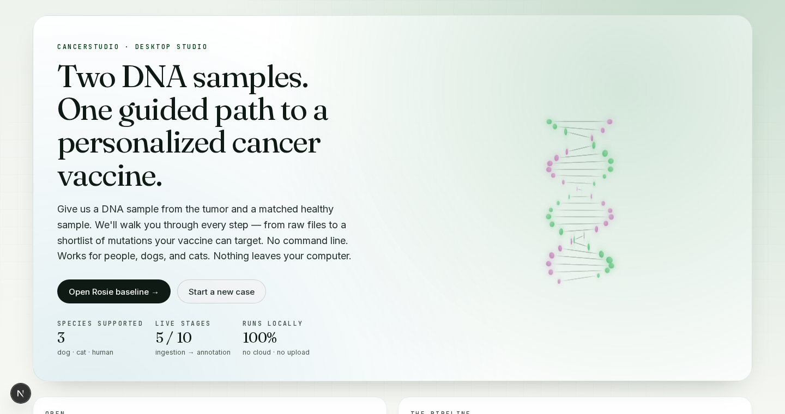
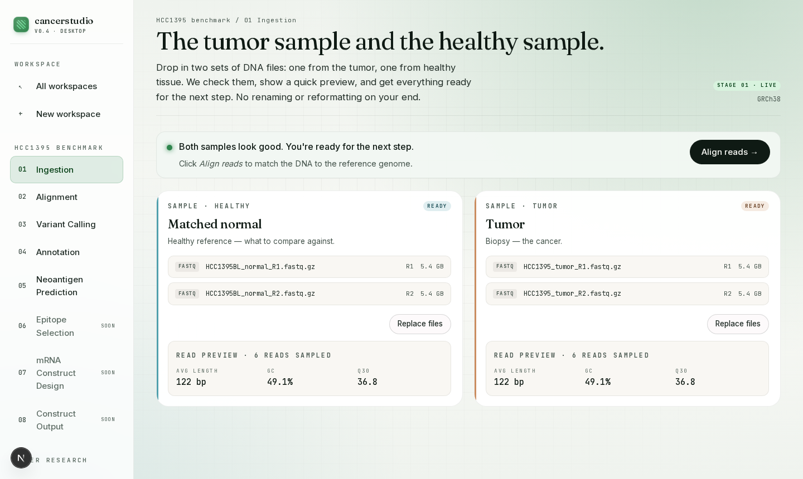
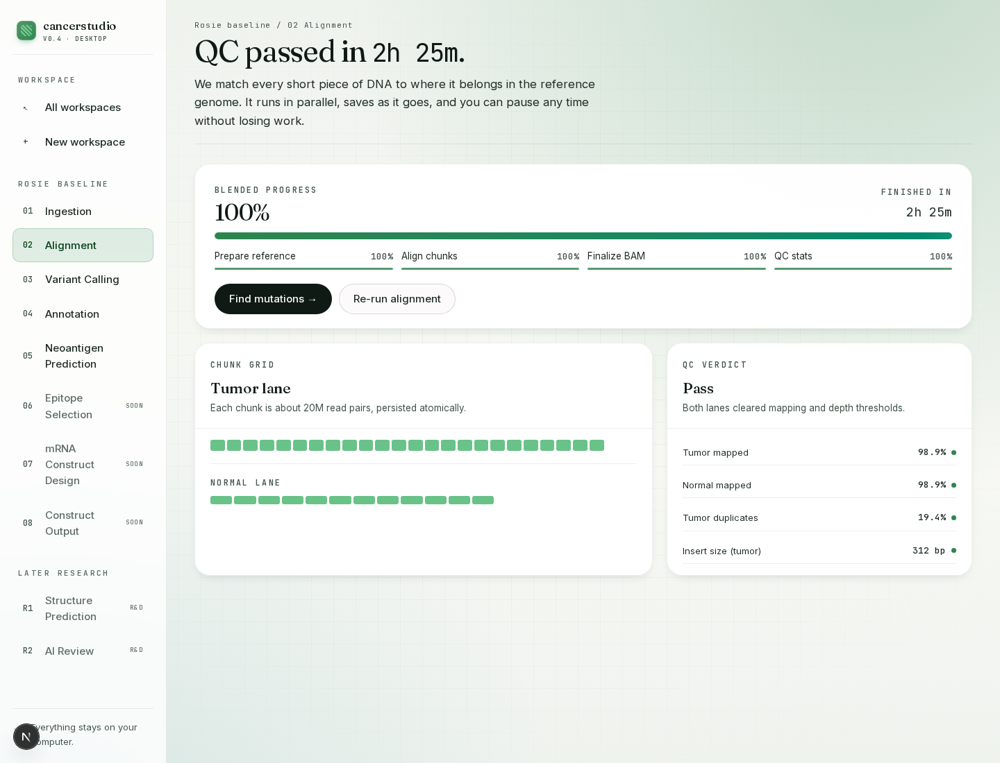
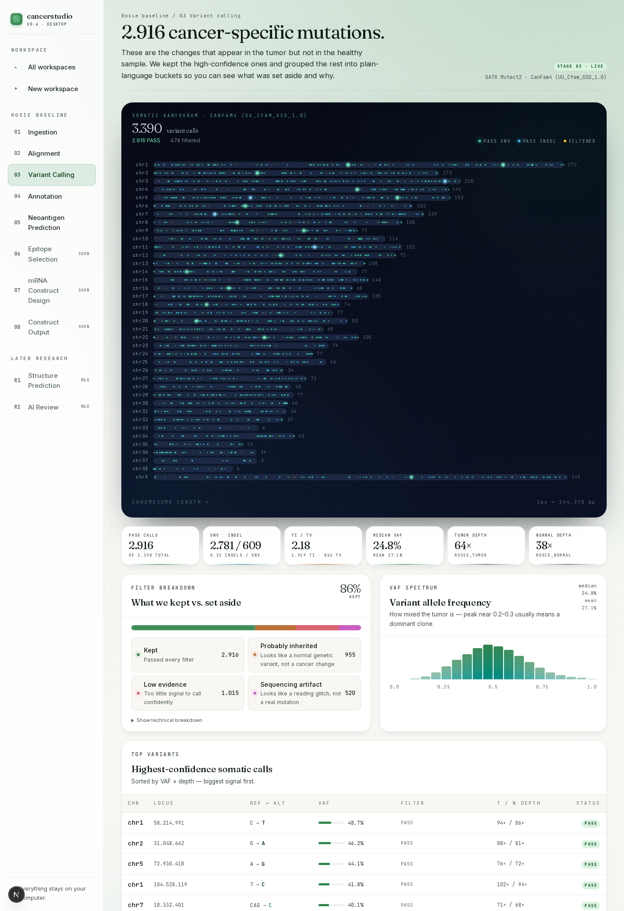
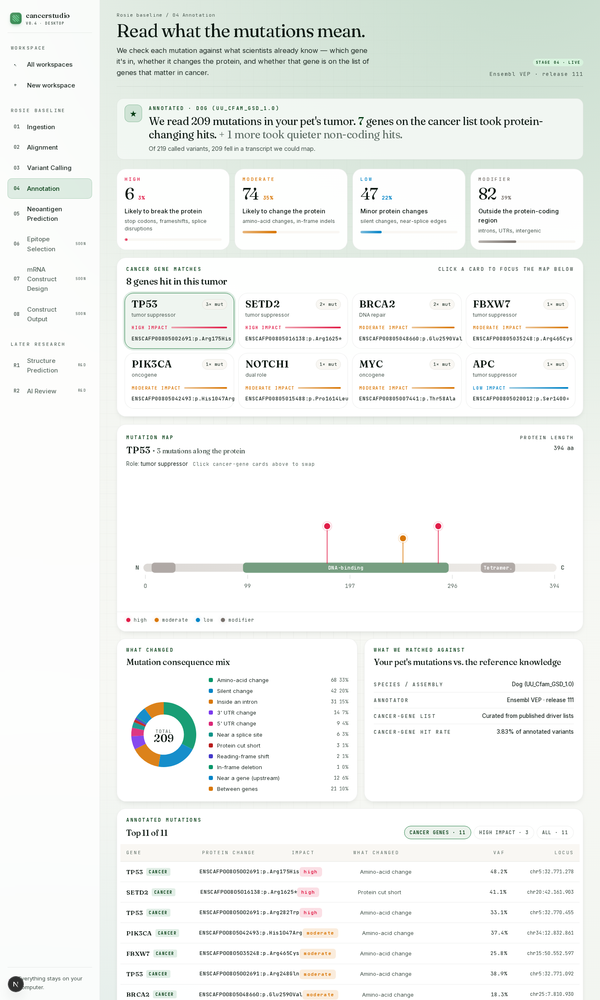
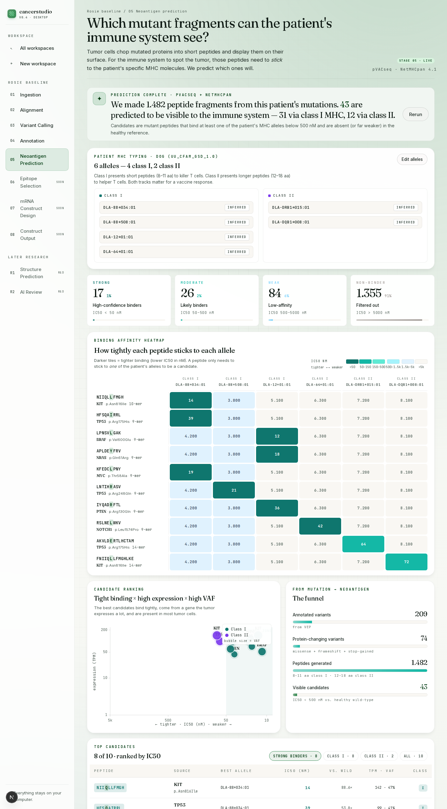
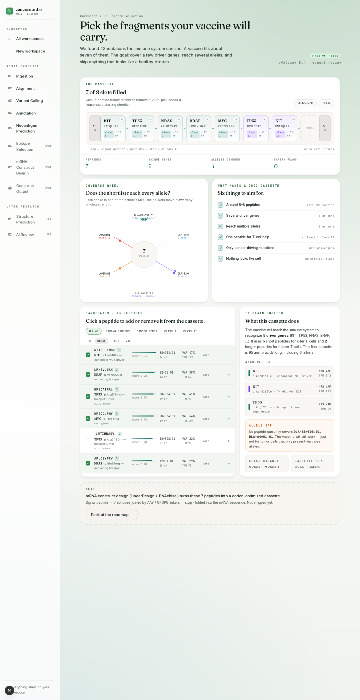

# cancerstudio

cancerstudio is a desktop-first studio for the first guided steps of a personalized cancer vaccine workflow. Today it helps a non-technical operator bring in local tumor and matched-normal sequencing files, prepare alignment-ready inputs on disk, run alignment against a species reference, find the cancer-specific mutations with an interactive karyogram, read what those mutations mean with a plain-English gene-centric annotation panel, predict which mutant fragments the immune system can see with pVACseq + NetMHCpan, and curate the final cassette from those candidates. Downstream vaccine-design stages stay visible as roadmap items, not runnable promises.

Project site: <https://niach.github.io/cancerstudio/>

## Screenshots

| Pick a species | Stage the samples | Run alignment | Find the mutations | Read what they mean |
| --- | --- | --- | --- | --- |
|  |  |  |  |  |

| Score the neoantigens | Curate the cassette | | | |
| --- | --- | --- | --- | --- |
|  |  | | | |

## Pipeline

`Ingestion → Alignment → Variant Calling → Annotation → Neoantigen Prediction → Epitope Selection → mRNA Construct Design → Construct Output`

| # | Stage | State | Tools |
| --- | --- | --- | --- |
| 1 | Ingestion | **Live** | samtools, pigz, fastp |
| 2 | Alignment | **Live** | strobealign, samtools |
| 3 | Variant Calling | **Live** — GATK Mutect2 + FilterMutectCalls, rendered as karyogram, plain-language filter buckets, VAF histogram, and a top-variants table | GATK Mutect2 |
| 4 | Annotation | **Live** — Ensembl VEP release 111 + pVACseq-ready Frameshift/Wildtype/Downstream plugins, rendered as cancer-gene cards, a lollipop plot of the top gene, impact tiles in plain English, and a filterable annotated-variants table | Ensembl VEP |
| 5 | Neoantigen Prediction | **Live** — pVACseq against class I (NetMHCpan 4.1) and class II (NetMHCIIpan 4.3), rendered as binding buckets, a peptide × allele heatmap, a VAF/binding scatter, an antigen funnel, and a top-candidates table | pVACseq, NetMHCpan |
| 6 | Epitope Selection | **Live** — curation UI on top of stage 5: 8-slot cassette, radial allele-coverage wheel, six plain-English goals checklist, filterable candidate deck, selection summary; picks persist per workspace | pVACview, custom scoring |
| 7 | mRNA Construct Design | Planned | LinearDesign, DNAchisel |
| 8 | Construct Output | Planned | pVACvector, Biopython |

Structure Prediction and AI Review stay in a separate disabled research track.

### Stage 2: chunked alignment on commodity hardware

The alignment pipeline splits each paired FASTQ into ~20M-read chunks and aligns them in parallel with fresh strobealign workers, then merges the per-chunk coord-sorted BAMs. A watcher thread enqueues chunks as they land on disk, so aligners start within ~60 s of the split beginning instead of waiting for the full split pass. A bounded queue back-pressures the splitter. Compute knobs (chunk size, parallelism, aligner threads, sort memory) live under the UI's `Advanced details` section with a live RAM-footprint estimator.

The panel surfaces honest progress for multi-hour runs: blended progress bar (5 % ref prep + 75 % chunk alignment + 15 % finalize + 5 % stats) + per-phase sub-bars, rolling-window ETA, heartbeat + stall detection, live command tail, and a desktop notification on long-run completion.

**Stop and resume.** Every aligned chunk is persisted atomically to `workspaces/{id}/alignment/{run_id}/chunks/{lane}/chunk_NNNN.coord-sorted.bam` with a manifest at `manifest.json`. Two side-by-side buttons surface the choice at decision time: *Stop & keep progress* preserves the manifest and every completed chunk BAM so a subsequent *Resume* skips them and only realigns the rest; *Cancel & discard* wipes the run directory and starts fresh. Finalize steps (markdup, index, flagstat, idxstats, stats) are idempotent — a pause during the tail phase only rebuilds what's missing on resume.

Verified end-to-end on COLO829 100× WGS (~2B tumor + 754M normal read pairs) on a 32-core workstation with 62 GB RAM: alignment finished in ~6h 26m, QC verdict pass, 98.91% tumor mapped / 98.86% normal mapped, 10 artifacts persisted.

### Stage 3: pet-owner-first variant calling

Stage 3 runs GATK Mutect2 + FilterMutectCalls on the aligned tumor/normal BAMs and parses the filtered VCF into four visual payoffs that a non-technical owner can actually read:

- **Karyogram** of every somatic call across the species' chromosomes, sized by VAF, colored by PASS vs. filtered status.
- **Metrics ribbon** — PASS calls, SNV:indel ratio, Ti/Tv, median VAF, and tumor/normal depth.
- **Plain-language filter breakdown** — raw Mutect2 flags (`panel_of_normals`, `strand_bias`, `weak_evidence`, …) are bucketed into four owner-friendly categories (Kept / Probably inherited / Low evidence / Sequencing artifact) with a one-click "Show technical breakdown" toggle for experts.
- **Top variants table** with locus, ref→alt, VAF bars, and T/N depth.

Tool names live in the Technical details drawer. The primary CTA is *Find mutations*, not *Run Mutect2*; the ready callout says "This runs on your computer using the reference genome for your pet's species" instead of "a filtered somatic VCF with its Tabix index and Mutect2 stats file".

### Stage 4: reading what the mutations mean

Stage 4 turns the filtered somatic VCF from stage 3 into something a pet owner can actually read. Ensembl VEP release 111 annotates every variant with gene, transcript, consequence, and impact against a species-specific offline cache (human `GRCh38`, dog `UU_Cfam_GSD_1.0`, cat `Felis_catus_9.0`). The pVACseq-ready plugins Frameshift, Wildtype, and Downstream are baked into the VEP command line, so the annotated VCF is a drop-in consumer for stage 5 without rerunning.

The panel is built around the same "one fancy viz + plain-English surfaces" pattern as stage 3:

- **Completion headline**: *"We read 209 mutations in your pet's tumor. 12 fell in 8 genes linked to cancer before."* — the emotional payoff line, not a consequence-term histogram.
- **Impact tiles** in plain English — *Likely to break the protein* (HIGH), *Likely to change the protein* (MODERATE), *Minor protein changes* (LOW), *Outside the protein-coding region* (MODIFIER) — with counts and proportion bars.
- **Cancer-gene cards** — every unique gene symbol hit that appears in the bundled cancer gene list, with its role (tumor suppressor / oncogene / DNA repair / fusion / dual role), mutation count, impact stripe, and top protein change. Clicking a card focuses the lollipop plot on that gene.
- **Lollipop plot** — the fancy viz — maps the focused gene's protein with each mutation as a lollipop, stick height keyed to impact and head color keyed to consequence category. Hover reveals position, HGVSp, and VAF.
- **Consequence mix donut** using plain-English labels (*Amino-acid change*, *Reading-frame shift*, *Silent change*, *Near a splice site*, …); the raw SO terms sit behind a toggle in the Advanced drawer.
- **Annotated variants table** with filter chips (Cancer genes · High impact · All), showing gene, plain-English change, impact pill, consequence, VAF.

The bundled cancer-gene list ships as `backend/app/data/cancer_genes.csv` — ~230 gene symbols with role/tier annotation, redistributable (symbols only, drawn from published driver lists). Dog and cat hits are matched by HGNC symbol since Ensembl uses aligned gene symbols across the three species. First-run cache install downloads the offline VEP cache for the workspace's species (~80 MB dog, ~552 MB cat, ~27 GB human) into a shared `/vep-cache` volume and persists it so later runs skip the download.

Verified end-to-end on a canine DLBCL workspace (PRJNA805123, SRR15540953 tumor + SRR15540951 skin-punch normal): ingestion → alignment (99.94% tumor / 98.69% normal mapped) → Parabricks GPU variant calling → VEP annotation emitted a pVACseq-ready CSQ with `FrameshiftSequence|WildtypeProtein|DownstreamProtein|ProteinLengthChange` from the plugins. Fetch script: `python3 scripts/fetch_canine_dlbcl_sample_data.py`.

### Stage 5: which fragments can the immune system actually see?

Stage 5 turns the annotated VCF from stage 4 into ranked peptide candidates. pVACseq runs twice against the workspace's patient-specific DLA/HLA alleles — class I against NetMHCpan 4.1, class II against NetMHCIIpan 4.3 — so a paused run can resume with class II alone without rerunning class I. The panel reads the `all_epitopes.tsv` / `filtered.tsv` output and renders five surfaces: binding buckets (strong / moderate / weak / none) with plain-language thresholds, a peptide × allele IC50 heatmap on a log scale, a VAF-versus-binding scatter, an antigen funnel (annotated variants → protein-changing → peptides → visible candidates), and a top-candidates table. The DLA allele panel is editable — expert users can type in clinically-relevant alleles, everyone else gets the species default.

Runtime phases are surfaced honestly: `generating_fasta → running_class_i → running_class_ii → parsing → finalizing`, with a pause-and-resume that skips already-scored peptides.

### Stage 6: picking the seven for the vaccine

Stage 6 is a curation surface on top of stage 5's output. Roughly 43 candidates land from the previous step; a realistic mRNA vaccine cassette fits about seven. The panel is organized around a single metaphor — an 8-slot cassette at the top, each slot a peptide, with AAY (class I) / GPGPG (class II) linker dots between slots and 5′ cap / 3′ poly-A blocks at the ends. Below that, a radial coverage wheel plots one spoke per patient allele with dots at their binding strength so allele gaps become obvious, a six-item goals checklist (class balance, driver-gene diversity, allele coverage, no passenger mutations, no self-similarity, size) ticks live as picks change, a filterable candidate deck lists all 43 peptides with a score bar + safety chip, and a plain-English selection summary describes what the resulting cassette actually does. Picks are persisted per workspace via a debounced PUT so closing the tab doesn't lose the shortlist. Expert mode surfaces the pVACview export commands. The handoff callout points forward at stage 7 (mRNA construct design) which stays on the roadmap.

## How it works

- Local-only runtime: a single all-in-one Docker container bundles the FastAPI engine and every bioinformatics tool (samtools, pigz, strobealign, GATK, NVIDIA Parabricks, Ensembl VEP + plugins); the Next.js frontend runs on the host and is accessed in a browser at `http://localhost:3000`. No cloud, no object storage.
- Inbox intake: drop FASTQ/BAM/CRAM files into `<data-root>/inbox/` (defaults to `~/cancerstudio-data/inbox/`, override with `CANCERSTUDIO_DATA_ROOT` in `.env`). The app lists them for registration into a workspace — no OS file-picker, no host-path plumbing.
- Species presets: human `GRCh38`, dog `CanFam4`, cat `felCat9`. Missing references are downloaded and indexed on first alignment.
- Paired-lane model: tumor and normal are separate lanes. Alignment unlocks only when both lanes are ready; a QC pass unlocks variant calling, while `warn` or `fail` keeps the workflow blocked in plain language.
- GPU-accelerated variant calling: when the container sees an NVIDIA GPU, stage 3 runs NVIDIA Parabricks `mutectcaller` (5–15× faster than CPU Mutect2 on a single RTX 4090). Without a GPU it falls back to CPU GATK Mutect2 in the same image.

## Stack

- Frontend: Next.js 15.5, React 19, TypeScript, Tailwind CSS (runs on the host)
- Backend: FastAPI + SQLAlchemy + samtools, pigz, strobealign, GATK Mutect2, NVIDIA Parabricks, Ensembl VEP 111 with Frameshift/Wildtype/Downstream plugins (all shipped in one Docker image, orchestrated by `docker compose`)
- Storage: local filesystem + SQLite under a host-directory data root (default `~/cancerstudio-data`)

## Local development

Install dependencies once:

```bash
npm install
docker compose build       # ~10 GB image, first build is slow
```

Run the app in development:

```bash
npm run backend            # docker compose up — FastAPI on :8000
npm run dev                # Next.js on :3000
# Then open http://localhost:3000 in your browser.
```

Or both in one go:

```bash
npm run dev:all            # concurrently runs `next dev` + `docker compose up`
```

The backend container bind-mounts `<data-root>` (defaults to `~/cancerstudio-data`, override via `CANCERSTUDIO_DATA_ROOT` in `.env`) at `/app-data` and `<data-root>/inbox/` at `/inbox`. Backend source in `backend/app` is bind-mounted for `uvicorn --reload`. Python tests run against the container: `docker compose run --rm backend pytest`.

## Environment

Copy `.env.example` to `.env` for local overrides. The most important settings are:

- `CANCERSTUDIO_APP_DATA_DIR`: managed app-data root for local outputs and cached references
- `LOCAL_SQLITE_PATH`: optional explicit SQLite location
- `SAMTOOLS_REFERENCE_FASTA`: local FASTA used when CRAM normalization needs a reference
- `REFERENCE_*_FASTA`: optional manual override for human/dog/cat references

If you do not set `REFERENCE_*_FASTA`, cancerstudio caches preset references under the app-data directory and prepares them on first alignment.

## System requirements

cancerstudio ships the entire backend — FastAPI, samtools, pigz, strobealign, GATK Mutect2, and NVIDIA Parabricks — in a single Docker image built on top of `nvcr.io/nvidia/clara/clara-parabricks:4.7.0-1`. The host only needs Docker (and, for GPU variant calling, the NVIDIA driver + container toolkit).

| Requirement | Why |
|-------------|-----|
| Docker Engine ≥ 24.0 (Linux) or Docker Desktop (macOS / Windows) | Runs the backend container |
| NVIDIA driver ≥ 570 + `nvidia-container-toolkit` (optional) | Enables GPU variant calling via Parabricks `mutectcaller`; without it stage 3 falls back to CPU GATK Mutect2 |
| ≥ 35 GB free RAM at first alignment | `strobealign --create-index` peaks at ~31 GB while building the human index. The backend refuses to start indexing below this threshold so the host doesn't get pushed into swap. |

### Install Docker + NVIDIA toolkit on Ubuntu / Debian / Linux Mint

```bash
# Docker Engine
curl -fsSL https://get.docker.com | sudo bash
sudo usermod -aG docker "$USER"

# NVIDIA Container Toolkit (skip on non-GPU hosts)
distribution=$(. /etc/os-release; echo $ID$VERSION_ID)
curl -fsSL https://nvidia.github.io/libnvidia-container/gpgkey \
  | sudo gpg --dearmor -o /usr/share/keyrings/nvidia-container-toolkit-keyring.gpg
curl -s -L https://nvidia.github.io/libnvidia-container/stable/deb/nvidia-container-toolkit.list \
  | sed 's#deb https://#deb [signed-by=/usr/share/keyrings/nvidia-container-toolkit-keyring.gpg] https://#g' \
  | sudo tee /etc/apt/sources.list.d/nvidia-container-toolkit.list
sudo apt-get update && sudo apt-get install -y nvidia-container-toolkit
sudo nvidia-ctk runtime configure --runtime=docker
sudo systemctl restart docker
```

### macOS / Windows

Install Docker Desktop. GPU-accelerated variant calling on macOS/Windows is currently not supported — stage 3 will run on CPU. On a GPU-less host everything else (ingestion, alignment, CPU variant calling) still works.

### Verify

```bash
docker --version
nvidia-smi              # optional; only needed for GPU variant calling
docker compose up -d    # pulls/builds the backend image, starts FastAPI on :8000
curl http://127.0.0.1:8000/health
```

Alignment compute is also tunable at runtime from the UI (Compute settings section on the alignment stage) — no env file edit needed. The overrides persist to `{CANCERSTUDIO_APP_DATA_DIR}/settings.json`:

- Chunk size (read pairs per chunk, default 20M)
- Parallel chunks (default 2)
- Aligner threads per chunk
- samtools sort memory per thread

### Standalone reference indexer

If *Start alignment* refuses with an "insufficient memory" callout, or you'd just rather not run the memory-hungry indexing inside the live app:

```bash
bash scripts/prepare-reference.sh
```

Defaults to `~/.local/share/cancerstudio/references/grch38/genome.fa`. Pass a different FASTA as the first argument to index something else. The script checks `MemAvailable`, refuses to start if <35 GB is free, runs `samtools faidx` + `strobealign --create-index -r 150`, then `gatk CreateSequenceDictionary` so Mutect2 can use the reference. Once it finishes, restart the backend — the alignment stage will detect the existing index and skip bootstrapping entirely.

## Tests

Fast / local:

```bash
npm run test:fast
```

That covers lint, TypeScript, and the backend suite that passes without a live server or real sequencing fixtures.

Browser integration:

```bash
npx playwright install chromium
npm run test:integration
```

Live real-data:

```bash
npm run sample-data:smoke
npm run test:backend:real-data
npm run test:browser:real-data
```

The live real-data path uses the COLO829 matched tumor/normal WGS smoke pair by default. Opt-in live alignment still requires local `samtools`, `strobealign`, and `pigz`, downloads and indexes `GRCh38` on first run unless `REFERENCE_GRCH38_FASTA` is already set, and only runs when `REAL_DATA_RUN_ALIGNMENT=1`.

## Sample data

The repo includes helpers for public smoke fixtures:

- COLO829/COLO829BL matched melanoma pair (ENA PRJEB27698) — smoke subset plus the full 100× tumor + 38× normal WGS for validating the chunked alignment pipeline at production scale
- Canine DLBCL matched tumor / skin-punch normal (SRA PRJNA805123) — the DLBCL1 pair (SRR15540953 + SRR15540951, same BioSample SAMN08874634) for verifying the canine pipeline and the stage-4 cancer-gene hits against genes like TP53, SETD2, and FBXW7
- a tiny BAM/CRAM smoke dataset for local normalization checks only

The COLO829 full fetch is ~174 GB compressed. Per-file md5s are checked against ENA-published values on download so silent corruption fails loudly.

Download with:

```bash
npm run sample-data:smoke                                 # COLO829 smoke (~50k read pairs per lane)
npm run sample-data:full                                  # COLO829 full 100x WGS (~174 GB)
npm run sample-data:alignment                             # BAM/CRAM normalization fixture
python3 scripts/fetch_canine_dlbcl_sample_data.py         # canine DLBCL smoke subset (~2.5 MB)
python3 scripts/fetch_canine_dlbcl_sample_data.py --mode full  # full DLBCL1 pair (~45 GB)
```
